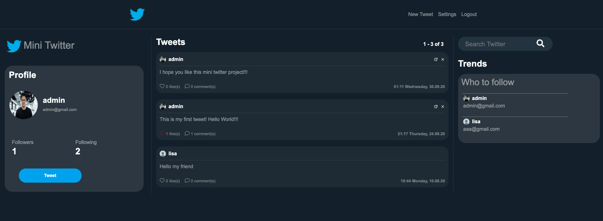

## Mini Twitter
A simulation of Twitter’s platform that allows users to post contents on feeds and interact with others using built-in features. \
• Allowed registered user post, like and follow other users, but unregistered users can only read posts. \
• Developed backend application in Python Django to handle HTTP requests and responses. \
• Used SQLite as database to store user's profile and posts. \
• Designed web pages using Bootstrap CDN framework to enable access across different browsers and platforms. 

## Demo
home page


login page


Create new tweet


Comment to the post


Change profile setting


## Setup

1. Git Clone the project with: ```git clone https://github.com/hongfu12321/mini_twitter```.
2. Move to the base directory: ```cd mini_twiiter```
3. Create a new python enveronment with: ```python -m venv env```.
4. Activate enveronment: ```env\Scripts\activate``` on windows, or ```source env/bin/activate``` on Mac and Linux.
5. Install required dependences with: ```pip install -r requirements.txt```.
6. Make migrations with: ```python manage.py makemigrations``` and then ```python manage.py migrate```.
7. Run app localy with: ```python manage.py runserver```.
